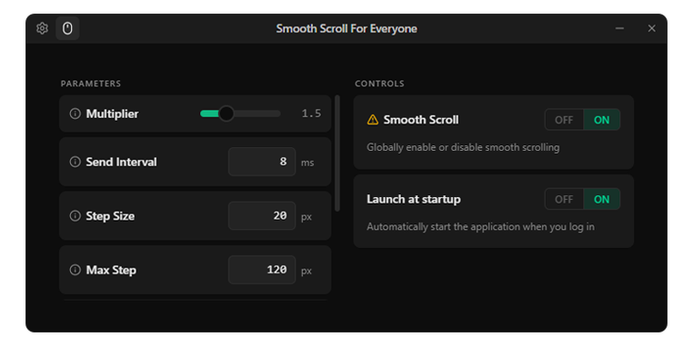
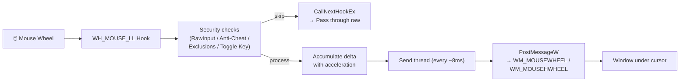

<p align="center">
  <picture>
    <source media="(prefers-color-scheme: dark)" srcset="">
    
  </picture>
</p>

<h1 align="center">Smooth Scroll For Everyone</h1>

<p align="center">
  <b>Replace Windows' jerky mouse wheel scrolling with fluid, accelerated motion —<br>
  completely invisible to anti-cheat systems, safe in any game or app.</b>
</p>

<p align="center">
  <a href="#features">Features</a> •
  <a href="#installation">Installation</a> •
  <a href="#settings-reference">Settings</a> •
  <a href="#building-from-source">Build</a> •
  <a href="#contributing">Contributing</a>
</p>

<p align="center">
  
  
  
  
</p>

<hr>

Does your mouse wheel feel sluggish and choppy in Windows? Do you miss the smooth scrolling from macOS or from high-end gaming mice? This free open-source app fixes that.

It sits quietly in your system tray, intercepts your mouse wheel, and replaces each clicky step with a buttery smooth accelerated scroll — without touching any game's memory, without hooking any dangerous APIs, and without ever flagging an anti-cheat.

<hr>

<div align="center">
    
</div>

## Features

### ⚙️ Smooth Acceleration Engine
Fine-tune every aspect of the scroll feel — multiplier, step size, gain, max speed, acceleration, and decay. Tweak to your liking or use the defaults and forget it.

### 🌊 Pulse Easing
Enable Michael Herf's viscous fluid model for a more natural, weighted scroll feel. Disable for a linear response — pick whichever suits your preference.

### 🎮 Anti-Cheat Safety (enabled by default)
Two layers of protection so you never accidentally smooth-scroll into a game:

- **Ignore RawInput** — detects foreground processes that have registered for RawInput mouse (every modern game does this) and automatically pauses smoothing.
- **Ignore Anti-Cheat** — scans the foreground process for 20+ known anti-cheat modules: EAC, BattlEye, ACE, PunkBuster, Ricochet, FACEIT, Tencent, ESEA, BlackCipher, and more. If one is loaded, smoothing stops.

Both checks are **read-only WinAPI calls** — no memory is written, no threads are hijacked, no traces are left.

### 🛡️ PostMessage Injection
Every synthetic scroll event is sent via `PostMessage` + `WindowFromPoint` directly to the window under your cursor. Unlike `mouse_event` or `SendInput`, this path **never sets the `LLMHF_INJECTED` flag** — the single bit that anti-cheat systems scan for in low-level mouse hooks. From the target window's perspective, your scroll looks exactly like a scroll from any other native window.

### 🖱️ Horizontal Scroll Hotkey
Hold Shift (or any key you choose) while scrolling vertically, and the app converts it into horizontal scroll events. Perfect for spreadsheets, timelines, and wide documents.

### 🔘 Hold-to-Disable Toggle
Map a key (Tab, Capslock, Home, Alt, or Shift) — hold it and smooth scrolling pauses instantly. Release and it resumes. Great for moments when you need pixel-precise native scrolling.

### 📋 Application Exclusions
Comma-separated list of EXE names to skip entirely. Supports names with or without the `.exe` extension. Example: `Adobe Premiere Pro, Discord, vscode.exe`

### 🧩 Single Instance
Only one copy runs. Lauch it again and the existing window comes to focus — whether it was hidden in the tray or behind other windows.

### 🪟 Tray Integration
Close to tray instead of quitting. Show, hide, or exit from the tray menu. Double-click the icon to restore the window.

### 🌐 i18n
English and Russian UI. Language is switchable from Settings without restart.

---

## Installation

**⬇️ [Download the latest release](https://github.com/SolicenTEAM/SmoothScrollForEveryone/releases)**

| Format | File | Use case |
|--------|------|----------|
| 🟢 **Standalone EXE** | `SmoothScrollForEveryone.exe` | Portable, no install, run from anywhere. |
| 🛠️ **NSIS Setup** | `SmoothScrollForEveryone_*_setup.exe` | Per-user install with start menu shortcut. |

### Minimum Requirements

- **OS:** Windows 10 or Windows 11 (x64 only)
- **Dependencies:** None required — .NET, Visual C++ Redistributable not needed
- **Privileges:** None — runs at user level, no admin needed

---

## Settings Reference

### Main Parameters

| Parameter | Default | What it does |
|-----------|---------|--------------|
| **Scroll Multiplier** | 1.5 | Base speed multiplier per wheel notch. |
| **Send Interval** | 8 ms | Time between synthetic events. Lower = more responsive, higher = smoother. |
| **Step Size** | 20 px | Minimum step sent per event. Controls how gradual low-speed scrolling feels. |
| **Max Step** | 120 px | Maximum step sent per event. The speed cap. |
| **Step Gain** | 40 | How fast the step grows as you scroll faster. Lower = more gradual acceleration. |
| **Max Accel** | 2.0 | Peak acceleration multiplier from sustained scrolling. |
| **Decay Time** | 150 ms | How quickly acceleration fades after you stop scrolling. |
| **Horizontal Key** | Shift | Hold while scrolling vertically → horizontal events. |
| **Pulse** | Off | Smooth easing curve. Try it on; switch back if you prefer linear. |

### Security (hardens against anti-cheat detection)

| Setting | Default | What it does |
|---------|---------|--------------|
| **Ignore RawInput** | On | Pauses smoothing when the foreground app uses RawInput mouse (games). |
| **Ignore Anti-Cheat** | On | Pauses smoothing when 20+ known AC DLLs are loaded. |

### Other

| Setting | Default | What it does |
|---------|---------|--------------|
| **Launch at Startup** | Off | Adds entry to `HKCU\...\Run`. Starts hidden in tray if Minimize to Tray is also on. |
| **Minimize to Tray** | Off | Close button hides to tray instead of quitting. |
| **Toggle Key** | Disabled | Hold to temporarily disable smoothing. |
| **App Exclusions** | — | Comma-separated EXE names (with or without `.exe`). |

---

## Architecture



### Why PostMessage is safe

1. `mouse_event` and `SendInput` always set the `LLMHF_INJECTED` (0x01) flag in `MSLLHOOKSTRUCT.flags` — any third-party low-level mouse hook (including anti-cheat) can see this bit and flag your application.
2. `PostMessage` bypasses the entire input pipeline. No `MSLLHOOKSTRUCT` is created, no `LLMHF_INJECTED` is set. The target window receives the message as if it came from any other native window.
3. The hook (`WH_MOUSE_LL`) intercepts the **original** wheel event, smooths it, swallows it (returns 1), and our send thread posts the smoothed replacement. The game's own hook never sees the replacement.

All security checks (`GetRegisteredRawInputDevices`, `CreateToolhelp32Snapshot`/`Module32FirstW`) are **read-only** — they query system state without writing memory or injecting into other processes.

---

## Building from Source

### Prerequisites

- [Rust](https://rustup.rs/) (MSRV 1.77.2)
- [Node.js](https://nodejs.org/) 18+
- Windows SDK (included with Visual Studio Build Tools or Visual Studio 2022)

### Quick Start

```bash
git clone https://github.com/SolicenTEAM/SmoothScrollForEveryone.git
cd SmoothScrollForEveryone

npm install                  # Install JS dependencies

npm run tauri dev            # Dev mode with hot-reload
npm run tauri build          # Release build
```

The standalone EXE lands at `src-tauri/target/release/app.exe`.

### Build Artifacts

| Artifact | Path |
|----------|------|
| Standalone EXE | `src-tauri/target/release/app.exe` |
| MSI installer | `src-tauri/target/release/bundle/msi/*.msi` |
| NSIS installer | `src-tauri/target/release/bundle/nsis/*.exe` |
| Frontend dist | `dist/` |

---

## Contributing

Pull requests, bug reports, and feature requests are all welcome.

- **🔍 [Report a bug](https://github.com/SolicenTEAM/SmoothScrollForEveryone/issues/new?labels=bug&template=bug_report.yml)** — include your Windows version, app version, and the target application.
- **💡 [Suggest a feature](https://github.com/SolicenTEAM/SmoothScrollForEveryone/issues/new?labels=enhancement&template=feature_request.yml)** — tell us what you'd like to see.
- **🛠️ [Submit a PR](https://github.com/SolicenTEAM/SmoothScrollForEveryone/compare)** — please review the [PR template](pull_request_template.md) first.

### Translation

UI strings live in `src/locales/{en,ru}/translation.json`. If you add or change a string, update both languages.

### Code Style

- Rust: follow existing patterns in `smooth_scroll.rs`, no unsafe unless necessary.
- TypeScript/React: use the existing component structure, shadcn/ui primitives, Tailwind 4.
- Always run `cargo check` + `tsc --noEmit` before committing.

---

## License

**MIT** — do what you want with it.

## Thanks
- [Smoothscroll-for-windows](https://github.com/re1von/Smoothscroll-for-windows) - for the original idea and initial code for study.
- [Smoothscroll-for-websites](https://github.com/galambalazs/smoothscroll-for-websites) - for the original code for implementing algorithms.
- [Blur-AutoClicker](https://github.com/Blur009/Blur-AutoClicker) - as an interface template that I looked at during development.

---

<p align="center">
  <b>Smooth Scroll For Everyone</b> — made with ❤️ by <a href="https://github.com/DenisSolicen">Denis Solicen</a>.
</p>
